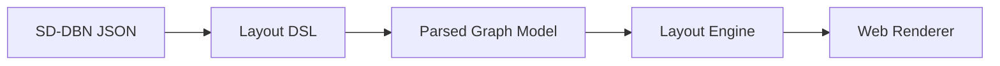

# SD-DBN Layout

SD-DBN を Web 上で表示するための layout / notation / renderer の作業ディレクトリです。

目的は、Mermaid のように人間が読めるテキストフォーマットから SD-DBN の表示モデルを作り、
ブラウザ上で schema / events / belief / argument state を表示する reusable component を提供することです。

## First Decision

最初にやるべきことは、表示を直接作ることではなく、責務を3層に分けることです。



| Layer | Responsibility |
|---|---|
| Layout DSL | Mermaid 風の記法。SD-DBN core を壊さず、表示したい node / relation / event state を宣言する。 |
| Parsed Graph Model | DSL または SD-DBN JSON から作る中間表現。renderer に依存しない。 |
| Layout Engine | role / scheme / kind / evidence_state に基づき、node の列・階層・edge routing を決める。 |
| Web Component | SVG renderer と pan / zoom / hover / selection を持つ `sd-dbn-canvas` を提供する。 |

## SD-DBN Format Mapping

The component accepts the layout canvas model directly. Use `sdDbnToCanvas()` when the source is an SD-DBN Format document.

```js
import { defineSdDbnCanvasElement, sdDbnToCanvas } from "@salescore-inc/sd-dbn-layout";

defineSdDbnCanvasElement();
document.querySelector("sd-dbn-canvas").canvas = sdDbnToCanvas(sdDbnDocument);
```

| SD-DBN Format | Layout Model |
|---|---|
| `schema.variables[]` | `nodes[]`, grouped by `kind` / latent `role` |
| `schema.relations[]` | `edges[]` with `id`, `from`, `to`, and `scheme` label |
| latest `believed` / `observed` / `situated` event per `variable` | node projection state, value, and posterior |
| latest `argued` event per `relation_id` | edge projection state |
| `kind`, `role`, `subkind`, `domain` | renderer-neutral `sdDbn` metadata |

## Initial Scope

1. SD-DBN core は変更しない。
2. `evidence_state` は `agreed` / `mentioned` / `rejected` の3値として扱う。
3. 未点灯や `none` は renderer 側の projection state として扱う。
4. 営業語彙は layout preset として扱い、format core には入れない。
5. 最初の renderer は SVG を優先する。debug しやすく、DOM inspection と hover 表示が簡単なため。

## Run

```bash
cd /Users/1amageek/Desktop/salescore/sd-dbn-layout
python3 -m http.server 4173
```

Then open `http://localhost:4173`.

## Storybook

```bash
cd /Users/1amageek/Desktop/salescore/sd-dbn-layout
npm install
npm run storybook
```

Then open `http://localhost:6006`.

Preview coverage:

| Story | Focus |
|---|---|
| Projection / Default | Baseline SD-DBN projection. |
| Format JSON / Projection | SD-DBN Format JSON converted with `sdDbnToCanvas()`. |
| Nested Groups | Group-Group, Node-Node, and Group-Node edges. |
| VStack / HStack | Direction override behavior. |
| Dense Margins | Compact spacing behavior. |
| Deep Nested | Three-level nested groups with mixed directions. |
| Cross Edges | Multiple cross-column relations. |
| Mixed Canvas | Canvas-level nodes mixed with nested groups. |
| Compact Node Size | Canvas-level fixed `nodeSize` override. |
| API / Viewport Focus | Public focus and viewport APIs. |
| Stress / Adjacent Groups | 5 groups, 10 nodes per group, only adjacent group node connections. |

## Component Usage

```html
<div data-theme="dark">
  <sd-dbn-canvas id="graph"></sd-dbn-canvas>
</div>
<script type="module">
  import { defineSdDbnCanvasElement } from "./src/components/SdDbnCanvas.js";
  import { sampleCanvas } from "./src/examples/sampleGraph.js";

  defineSdDbnCanvasElement();
  document.querySelector("#graph").canvas = sampleCanvas;
</script>
```

The component supports `data-theme="light"`, `data-theme="dark"`, `data-theme="forest"`, `data-theme="mono"`, and `data-theme="contrast"` on any ancestor. Without an explicit theme, it follows `prefers-color-scheme`.
The minimap is visible by default. Set `minimap="false"` or call `hideMinimap()` to hide it.

## Viewport API

```js
const canvas = document.querySelector("sd-dbn-canvas");

canvas.optimizeViewport();
canvas.fitViewport({ padding: 72, maxScale: 1.4, duration: 420 });
canvas.focusNode("N_response_2");
canvas.focusNode("N_response_2", { highlight: true });
canvas.focusGroup("G_diagnosis", { padding: 120, duration: 520 });
canvas.focusItem("G_process_evidence");
canvas.highlightNode("N_people_1");
canvas.highlightGroup("G_process");
canvas.clearHighlight();
canvas.clearFocus();
canvas.clearVisualState();
canvas.showMinimap();
canvas.hideMinimap();
canvas.setViewport({ x: 0, y: 0, scale: 1 });
const viewport = canvas.getViewport();
```

| Method | Meaning |
|---|---|
| `optimizeViewport(options?)` | Fit the whole rendered graph into the viewport. |
| `fitViewport(options?)` | Alias-level full graph fit with configurable padding and scale. |
| `focusNode(nodeId, options?)` | Fit and center a specific node and mark it as focused. Pass `{ highlight: true }` to highlight it at the same time. |
| `focusGroup(groupId, options?)` | Fit and center a specific group and mark it as focused. Pass `{ highlight: true }` to highlight it at the same time. |
| `focusItem(itemId, options?)` | Fit and center a node or group by id and mark it as focused. |
| `highlightNode(nodeId)` | Highlight a node without changing the viewport. |
| `highlightGroup(groupId)` | Highlight a group without changing the viewport. |
| `highlightItem(itemId, options?)` | Highlight a node or group by id. Pass `{ mode: "add" }` to add without replacing existing highlights. |
| `clearHighlight()` | Clear highlights without clearing focus. |
| `clearFocus()` | Clear focus without clearing highlights. |
| `clearVisualState()` | Clear both focus and highlights. |
| `showMinimap()` | Show the minimap overlay. |
| `hideMinimap()` | Hide the minimap overlay. |
| `setMinimapVisible(isVisible)` | Toggle the minimap overlay. |
| `setViewport(transform)` | Set `{ x, y, scale }` directly. |
| `getViewport()` | Return the current viewport transform. |

Viewport methods animate by default. Pass `{ animate: false }` or `{ duration: 0 }` for immediate updates.
Focus and highlight are independent visual states, so a focused item and a highlighted item can be shown at the same time.
The minimap viewport rectangle follows scroll, pinch zoom, and animated API viewport changes.

## Gestures

| Input | Behavior |
|---|---|
| Wheel / trackpad scroll | Pan the canvas. |
| Pinch | Zoom around the pinch center. |
| Drag | No canvas gesture. |

## Layout Options

| Option | Default | Meaning |
|---|---|---|
| `nodeSize` | `{ width: 204, height: 82 }` | Fixed display size for every node in the Canvas. |
| `nodeEdgeJoint.minLength` | `28` | Minimum normal segment length where an Edge leaves or enters a port. |
| `margins.nodeNode.x` | `108` | Minimum horizontal margin between sibling nodes. |
| `margins.nodeNode.y` | `56` | Minimum vertical margin between sibling nodes. |
| `margins.groupGroup.x` | `88` | Minimum horizontal margin between sibling groups. |
| `margins.groupGroup.y` | `66` | Minimum vertical margin between sibling groups. |

## Directory Plan

```text
sd-dbn-layout/
  README.md
  index.html
  docs/
    architecture.md
    dsl.md
    layout-spec.md
  examples/
    basic.sdbnl
  src/
    app.js
    styles.css
    components/
      SdDbnCanvas.js
      SdDbnCanvas.stories.js
    examples/
      sampleGraph.js
      previewGraphs.js
    parser/
    layout/
      engine.js
    renderer/
      svgRenderer.js
```
