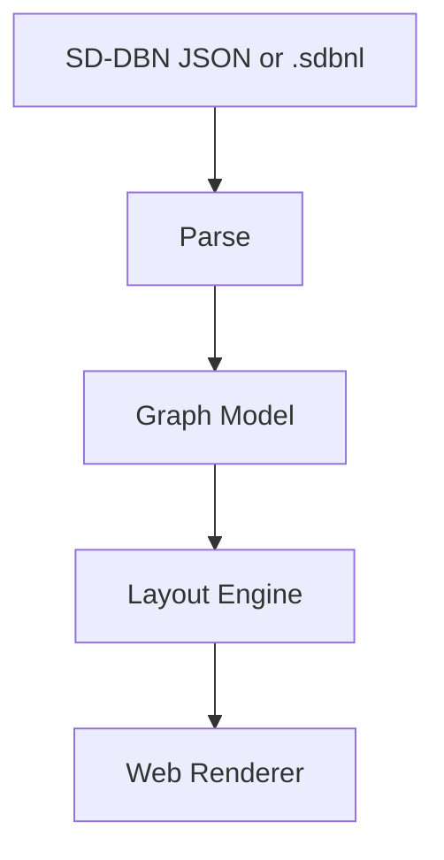

# Architecture

## Goal

SD-DBN の schema と events を、ブラウザで調査しやすい graph layout として表示する。

表示対象は2種類あります。

| Target | Meaning |
|---|---|
| Schema view | variable / relation の不変構造を表示する。 |
| Event projection view | 点灯、到達状態、posterior、argued relation など events から導いた状態を重ねる。 |

## Proposed Pipeline



## Graph Model

Layout engine が受け取る中間表現は、SD-DBN JSON と DSL のどちらからでも作れるようにします。

```ts
type LayoutNode = {
  id: string;
  kind: "situation" | "latent" | "observation";
  role?: "state" | "goal" | "means" | "obstacle" | "factor";
  label: string;
  evidenceState?: "agreed" | "mentioned" | "rejected";
  posterior?: Record<string, number>;
};

type LayoutEdge = {
  id: string;
  from: string;
  to: string;
  type: "situational" | "conditioning" | "inference" | "conflict" | "preference" | "emission";
  scheme: string;
  evidenceState?: "agreed" | "mentioned" | "rejected";
};
```

## Layout Rules

初期 layout は、SD-DBN の意味構造に合わせて列を分けます。

| Column | Nodes |
|---|---|
| Situation | `kind=situation` |
| State / Goal | `role=state` / `role=goal` |
| Means | `role=means` |
| Obstacle / Factor | `role=obstacle` / `role=factor` |
| Observation | `kind=observation` |

Edge style は `scheme` と `type` で決めます。

| Relation | Style |
|---|---|
| `CONDITIONS` | thin solid |
| `CAUSES` / `COMPOSES` | solid |
| `RESOLVES` | solid with relief marker |
| `CONFLICTS` | dashed red |
| `MANIFESTS_AS` | dotted |
| `PREFERS` | double-line or priority marker |

## Web Requirements

- SVG renderer
- pan / zoom
- node hover details
- relation hover details
- state filter: all / agreed / mentioned / rejected / unlit
- schema view and event projection view

