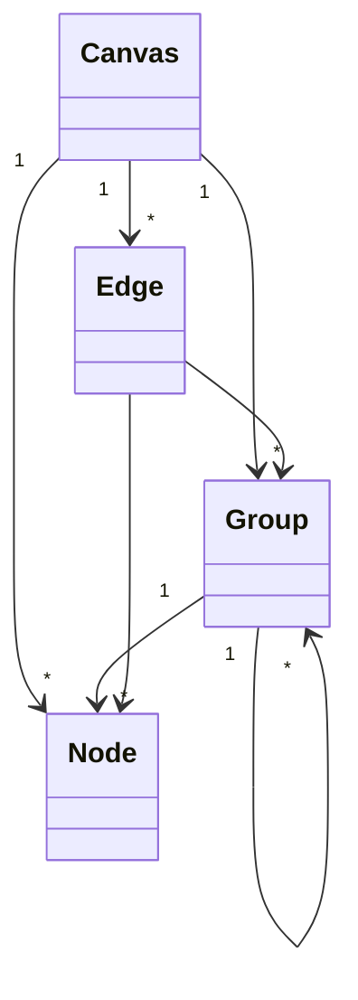
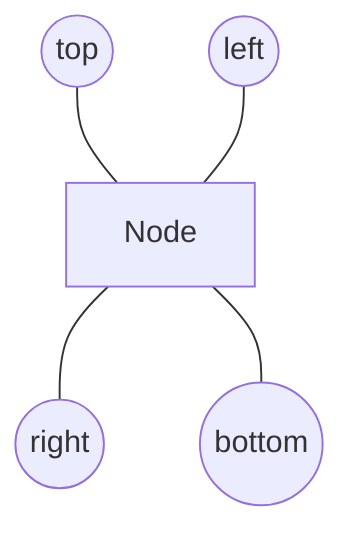

# Layout Specification

This document defines the display model and layout contract for SD-DBN graph visualization.

## Object Model



| Object | Required Behavior |
|---|---|
| Canvas | Owns top-level nodes, groups, edges, viewport, pan, and zoom. |
| Group | Owns nested nodes and groups. Groups may be nested. |
| Node | Has a fixed canvas-level display size, a label, and four ports: top, right, bottom, left. |
| Edge | Connects Node-Node, Group-Group, or Group-Node and displays a label. |

## Node Size

All nodes in the same Canvas use the same display size. The default is `204 x 82`, and a Canvas may override it with `nodeSize`.

Node labels wrap inside the fixed box. Node content does not resize the node.

## Layout Direction

Each Canvas or Group may set one of:

| Direction | Meaning |
|---|---|
| `vstack` | Children are arranged vertically. |
| `hstack` | Children are arranged horizontally. |
| `auto` | The layout engine selects the lower-cost result. |

## Minimum Margins

Margins are lower bounds, not fixed values. The layout engine may increase them when the cost function finds a better graph.

| Pair | Constant |
|---|---|
| Node-Node | `nodeNode` |
| Group-Group | `groupGroup` |
| Group-Node | `groupNode` |
| Node-Edge joint | `nodeEdgeJoint.minLength` |

## Cost Function

The layout engine evaluates candidate placements with this objective:

```text
cost =
  areaWeight * boundingArea
  + aspectWeight * aspectPenalty
  + edgeWeight * edgeLength
  + overlapWeight * overlapPenalty
  + marginWeight * extraMarginPenalty
  + routeWeight * routedEdgeCost
```

Hard constraints:

1. Node size is fixed within a Canvas.
2. Margins are never smaller than the pair-specific minimum margin.
3. Children inside a group are placed to minimize the group area.
4. Top-level children inside Canvas are placed to minimize the Canvas viewport display area.
5. Viewport minimization changes content bounds, not zoom level.

## Ports

Node ports are placed at the middle of each side.



Edges evaluate all top / right / bottom / left port combinations and use orthogonal routing by default.

Every edge must meet a port along the port normal. The route starts with a normal segment from the source port and ends with a normal segment into the target port.

| Port | Required joint direction |
|---|---|
| `top` | Upward normal segment. |
| `right` | Rightward normal segment. |
| `bottom` | Downward normal segment. |
| `left` | Leftward normal segment. |

Edge joints may be straight or turn by 90 degrees. A 180-degree reverse turn is invalid.

## Edge Routing

Nodes are routing obstacles. An edge may connect to its source and target nodes, but route candidates receive a high cost when they pass through any other node.

```text
routedEdgeCost =
  lengthWeight * pathLength
  + bendWeight * bendCount
  + nodeOverlapWeight * nodeOverlapArea
  + portDirectionWeight * inwardPortPenalty
  + jointWeight * nodeEdgeJointViolation
```

| Cost | Purpose |
|---|---|
| `pathLength` | Prefer shorter routes when there is no conflict. |
| `bendCount` | Prefer fewer bends. |
| `nodeOverlapArea` | Strongly avoid crossing non-endpoint nodes. |
| `inwardPortPenalty` | Avoid leaving or entering a port through the node body. |
| `nodeEdgeJointViolation` | Disallow non-normal or too-short node-edge joints. |

## Web Interaction

The Canvas surface supports:

| Gesture | Behavior |
|---|---|
| Wheel / trackpad scroll | Pan viewport. |
| Pinch | Zoom around pointer or pinch center. |
| Reset | Return to the initial transform. |
| Fit | Pan and scale to fit content bounds. |
